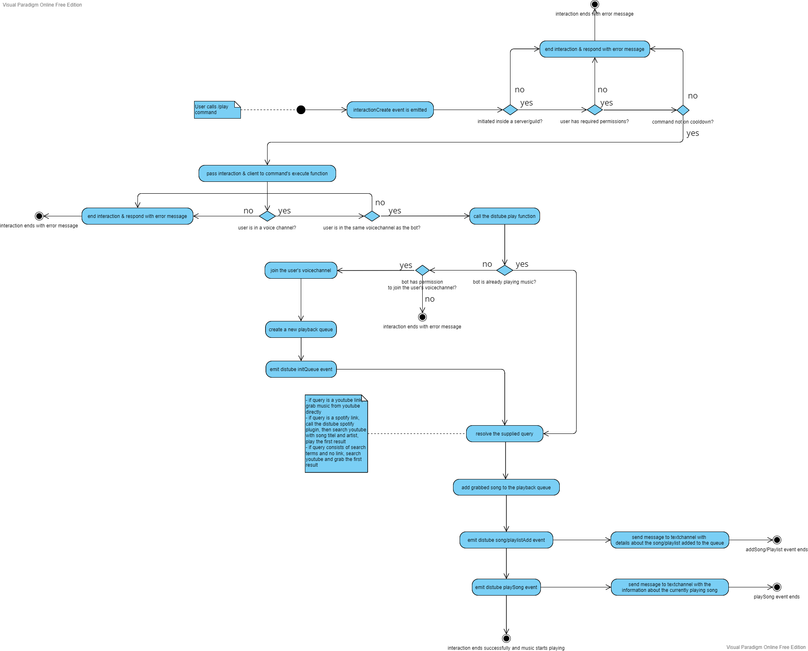

# UCB Music - A music bot template for discord
## How to get started

1. Create a new Discord Application
	- Log in to the [Discord Developer Portal](https://discord.com/developers/applications) with your usual Discord Login credentials.
	- Use the **New Application** Button in the top right. 
	- Name your application and agree to the terms of service and policy.
	- Navigate to the **Bot** settings tab. 
	- Use the **Add Bot** button. 
	- Make the bot **private** or leave it public. This depends on your future plans. 
	- Enable all **Privileged Gateway Intents**. 
	- Navigate to **0Auth2** and the Subtab **URL Generator**.
	- Tick the boxes for *bot* & *applications.commands* under **SCOPES**. 
	- Under **BOT PERMISSIONS** tick the boxes for
			- *Send Messages*
			- *Embed Links*
			- *Use External Emojis*
			- *Add Reactions*
			- *Connect*
			- *Speak*
		--> 
	- Copy the **GENERATED URL** and open it.
	- Select the server you want to add the Bot to from the dropdown. 
	- *(optional)* If you can't see a server in the dropdown, you have to create one. Just complete the following steps and you will be set and good to go on.
	- *(optional) How to create a discord server:* 
	- *(optional)* Open you Discord-Application & log in.
	- *(optional)* Click on the **+** button and create a new server. 
	- *(optional)* Click on **Create My Own**. 
	- *(optional)* Click on **For me and my friends**. 
	- *(optional)* Give your server a name and click on **Create**. 
	- All we need now is the **Application ID** and the **TOKEN** of your bot. You can find the **APPLICATION ID** under the **General Information** tab. The **TOKEN** can be found under the **Bot** tab. Click the **Reset Token** button and copy your token. Both will be needed in the next step.
2. Clone the repo & set up the bot
	- Clone the repo to where ever you like
	- Run `npm install` to grab all the necessary packages.
	- Create a `.env` file in the repo's root directory.
	- Add your Token to the `.env` file `TOKEN=PASTE_YOUR_BOT_TOKEN_HERE` 
	- In a new line add you application id `CLIENTID=PASTE_YOUR_APPLICATION_ID_HERE`
	- *(optional)* If you know how to create a spotify api application you can also add it's credentials to the `.env` file. If you don't have the credentials you have to comment out a part of the code in the `index.ts`.  After that save the file and recompile with `npm run build`.
	- *(optional)* `SPOTIFYCLIENTID=PASTE_YOUR_SPOTIFY_CIENT_ID_HERE`
	- *(optional)* `SPOTIFYCLIENTSECRET=PASTE_YOUR_SPOTIFY_CLIENT_SECRET_HERE`
3. Start the bot with `npm run start` & enjoy music together!

--*It might take up to 2 hours until the bot's commands show up on your server*--

## Folder structure

```
ucb-music/src/
	commands/
		command-category/
			command.ts
	events/
		client/
			event.ts
		distube/
			distube-event.ts
	handlers/
		handler.ts
	interfaces/
		interface.ts
	schemas/
		schema.ts
	utility/
		utility.ts
	.env
	index.ts
```

### commands/
Holds all commands and command-category-folders

### commands/command-category/
Holds all commmands of a certain category

### events/
Holds all events emitted by either the discord.js bot client or the distube.js music playback package

### events/client/
Holds all events emitted by the discord.js bot client

### events/distube/
Holds all events emitted by the distube.js music playback package

### handlers/
Holds all handlers, e.g. command-handler, event-handler, ...

### interfaces/
Holds all interfaces to make typescript happy, e.g. UMCommand-interface

### schemas/
Holds all mongo-db schemas

### utility/
Holds the file with all utility classes & functions used across the project


## Activity diagrams

### play command


### queue command
